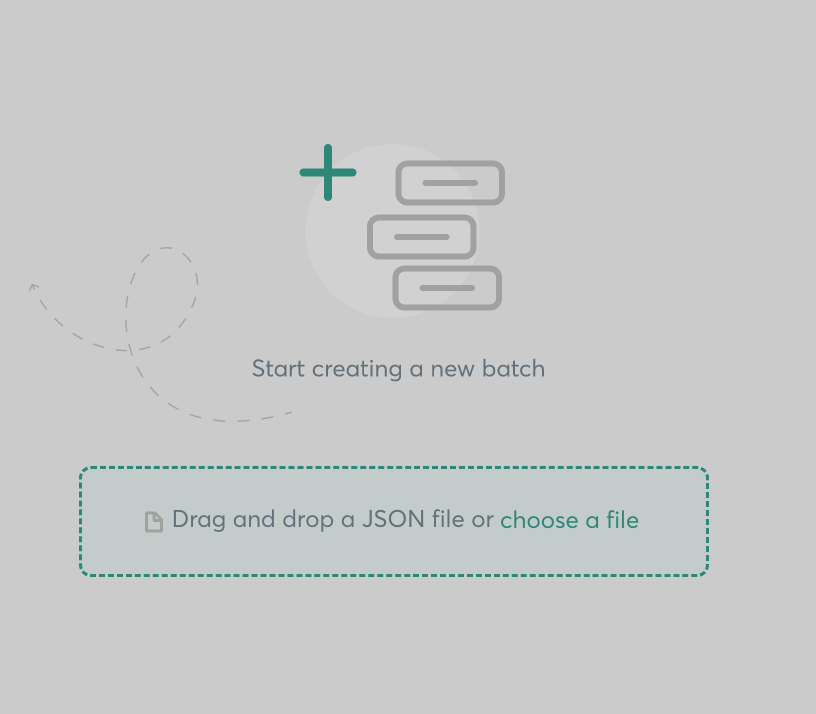

# Gnosis Tx-Builder from a script

[![npm package][npm-img]][npm-url]
[![Build Status][build-img]][build-url]
[![Downloads][downloads-img]][downloads-url]
[![Issues][issues-img]][issues-url]
[![Commitizen Friendly][commitizen-img]][commitizen-url]
[![Semantic Release][semantic-release-img]][semantic-release-url]

> ⚡🚀 Transform an array of transactions in a Transaction builder json for the Gnosis UX, based on ethers-js


## Install

```bash
npm install @morpho-labs/gnosis-tx-builder
```

```bash
yarn add @morpho-labs/gnosis-tx-builder
```

## Usage
Generate a Tx builder json file:

```typescript
import TxBuilder from "@morpho-labs/gnosis-tx-builder";
import { constants } from "ethers";
import fs from "fs"
const safeAddress = "0x12341234123412341234123412341232412341234"

const transactions = [
    {
        to: constants.AddressZero,
        value: parseEther("1").toString(),
        data: "0x",
    },
];

const batchJson = TxBuilder.batch(safeAddress, transactions);

// dump into a file
fs.writeFileSync("batchTx.json", JSON.stringify(batchJson, null, 2));


```

Now, with the json file, go to the Gnosis dApp, and select Transaction Builder app

[![Transaction builder][txbuilder-img]][gnosis-url]

And then, drag and drop the `batchTx.json` file 



And tada! 🎉🎉

[txbuilder-img]: img/tx-builder.png
[gnosis-url]: https://gnosis-safe.io/app
[build-img]: https://github.com/morpho-labs/gnosis-tx-builder/actions/workflows/release.yml/badge.svg
[build-url]: https://github.com/morpho-labs/gnosis-tx-builder/actions/workflows/release.yml
[downloads-img]: https://img.shields.io/npm/dt/@morpho-labs/gnosis-tx-builder
[downloads-url]: https://www.npmtrends.com/@morpho-labs/gnosis-tx-builder
[npm-img]: https://img.shields.io/npm/v/@morpho-labs/gnosis-tx-builder
[npm-url]: https://www.npmjs.com/package/@morpho-labs/gnosis-tx-builder
[issues-img]: https://img.shields.io/github/issues/morpho-labs/gnosis-tx-builder
[issues-url]: https://github.com/morpho-labs/gnosis-tx-builder/issues
[codecov-img]: https://codecov.io/gh/morpho-labs/gnosis-tx-builder/branch/main/graph/badge.svg
[codecov-url]: https://codecov.io/gh/morpho-labs/gnosis-tx-builder
[semantic-release-img]: https://img.shields.io/badge/%20%20%F0%9F%93%A6%F0%9F%9A%80-semantic--release-e10079.svg
[semantic-release-url]: https://github.com/semantic-release/semantic-release
[commitizen-img]: https://img.shields.io/badge/commitizen-friendly-brightgreen.svg
[commitizen-url]: http://commitizen.github.io/cz-cli/
